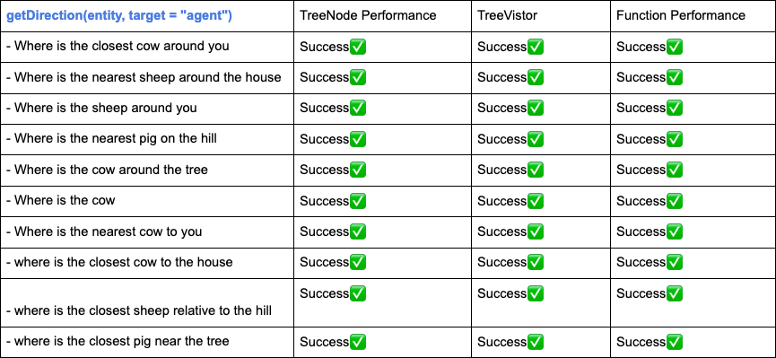

## Video

## Project Summary

The main goal of this project is to build an "environment-describing chatbot" which can understand users' questions about surrounding environment and answer expected information retrieved through Malmo API. To achieve this goal, we focused on two parts: the first part is natural language processing (NLP), and the second part is implement environment decribing functions to retrieve related information.

The main challenge is that, instead of matching our functions with specific language description/user questions, we want our NLP processing and functions to deal with languages with greater scope and flexibility when asking questions. In other words, our chatbot needs to have a clear understanding on the individual parts of the speech and the dependencies in between; in order to connect user questions with correct environmental describing function and pass corresponding arguments. For instance, consider two questions:

- "How many sheep are inside the house"
- "What animals are inside the house"

The meanings of these sentences are quite different, and our chatbot need to understand the first question is asking about "count(cows, inside(house))", and the second question is asking about "find(animals, inside(house))". In order to achieve this, using a deep learning model for NLP is necessary to help us to process the syntatic structure of user's question. We utilized AllenNLP constituency parsing tools into our project in order to get a syntatic tree model.

Besides understanding users' question, we also need environment describing functions to ensure we return accurate information to our users. In this part, we deployed Malmo API to get basic environment information in the enviornment we build in Minecraft, and create purpose functions by using these information. Our projects can handle questions like,

1. Find closest entity relative to agent architecture or other landscapes
2. Identify entity location relative to agent architecture or other landscapes
3. Count entities based on position
4. Describe current environment (such as find animals around the tree, and tell the location of the agent)

The challenge behind this part is that we need to be familiar and knowledgable enough to Malmo and efficiently convert the provided information to our environment describing function.

## Approaches
<p><em>Figure 1: Project Idea </em></p>

### Natural Language Processing through Constituency Parsing

In this project, we utilize the **AllenNLP constituency parsing** to to understand the syntatic structure of user's question, and build a new tree to store the constituency tree based on our needs and visit the new tree matching it with our function. Below is the picture showing the constituency tree AllenNLP generated for us: <p><em>Figure 2: Sample Constituency Tree </em></p>

The sample question of the above tree is "Where is the tree near the house", and the linearized version of the above contituency tree looks like '(SBARQ (WHADVP (WRB Where)) (SQ (VBZ is) (NP (NP (DT the) (NN tree)) (PP (IN near) (NP (DT the) (NN house))))))'. The basic idea is that we firstly built a new tree to store the contituency tree by pairing its label and covering texts. Then, we implement a tree vistor in order to go over all the tree and get part of the information we need to match with our functions and pass correct arguments. To accomplish that, we firstly pass the tree root to the visitor and use a stack structure to store the node's children. By recursively call visit on the children, we will go over all the node types, which we will ignore some useless labels/texts, and only extract information from valuable node. For instance, suppose we have a question like "Where is the cow near the house". We will firstly pass the tree node to our visitor, which is a node with label (SBARQ) and text "Where is the tree near the house". Then, by visiting its children node text, we will know it is a where question, so we match the question with our "getDirection(entity, target)" question. Then, we will recursively visit the node's children by pop(0) from our node stack structure and find "NN" label(noun) and pass it to our function.

Here are some pseudocode for our TreeNode and TreeVisitor:

```python
# store the constituency tree
class TreeNode:
    self.children = [] # to store all the Node
    self.label = "" # Node Label, e.g NN(Noun), NP(Noun Phrase) ...
    self.text = "" # Node Text: text that certain label covering  e.g. IN - near, NN - house

    def find_label:
        #all label are capital letter begin after "(" and stop at blank space

    def find_node:
        #find node label by matching "(" with ")" and construct new node and add it into self.children

    def find_text:
        #use regex to find text begin with white space and end before ")"

class TreeVisitor:
    self.nodeStack = [] #to store node children

    def visit(n):
      for n in n.children:
        self.nodeStack.append(n) #if children not in nodeStack

      if node.label == "SBARQ":
          return self.visit_sbarq(n)
      elif node.label == "NN":
          return self.visit_nn(n)
      elif ....:

      else:
          self.nodeStack.pop # to ignore useless node such as ("is", "the")
      ...

   def visit_sbarq(n):
      if n.children[0].text.lower() == "where":
            self.tag = "direction"
      return self.visit(n.children[1])

  def visit_nn(n):
      if self.tag == "direction":
            getDirection()
      elif ...
```

### Environmental Describing Function

To get the observation results from our agent, we generate our answers based on using the Malmo build-in function: **agent.peekWorldState()**. From the converted json text, we could get information of the surrounding envrionment based on our agent's current position. All of our four types of questions are implemented in the **CommandAction** Class.

#### Find closest entity relative to agent architecture or other landscapes

To get the closest entity near the agent or other lansacapes in the world, we will first get the current coordinate of the agent or the coordinates for our lansacpes. So far, our lansacpes (house, lake and hill) are defined by four coordinates, except for trees, which are defined by one coordinate. By computing the distance of the surrounding entities to our target, we will sort this result by their distance and then outputed the closest entity name. For house, lake and hill, we also excludes the

#### Identify entity location relative to agent architecture or other landscapes

#### Count entities based on position

#### Describe current environment (such as find animals around the tree, and tell the location of the agent)

## Evaluation
During the evaluation process, we focus on 1/evaluating the returning value of our **TreeNode**, 2/Accuracy of our **environment describing functions**, and 3/**TreeVisitor** functionality. Therefore, we divided our evaluation process into three phrases accordingly. To start with, we listed 10 sample questions based on each environmental describing function, and used them as sample input to test the success for each phrase. Here is a sample testing table of our "getDirection" function. 
<p><em>Figure 3: Sample Test Table </em></p>

In order to evaluate the TreeNode class, we built a __iter__ function in the class, in order to visually evaluate if it succesfully match syntatic label with its covering text. Since the success of our class TreeNode is discrete, by printing out each node's label and text, we are able to manually compare it with the constructed constituency tree and tell if it is successful or not. 

这里写如何test function的

We tested the TreeVisitor class after testing TreeNode and function. Since the TreeVisitor class used the return value of TreeNode as input and connect user command with our environmental describing functions, we need to make sure the accuracy of the first two phrases before going to this step. In this phrase, we focus on evaluating if 1/it successfully extract information to connect the input (user question) with our function, and if the argument is positioned into the right place. We tested TreeVisitor class by connecting with our environment describing functions in order to visually see the pass/failture of our class in Malmo. 


## References

#### [AllenNLP: Constituency Parsing](https://demo.allennlp.org/constituency-parsing)

#### [Project Malmo](https://github.com/microsoft/malmo)
