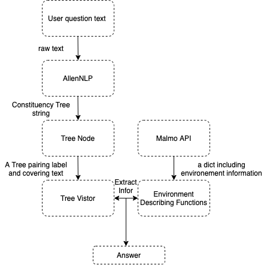
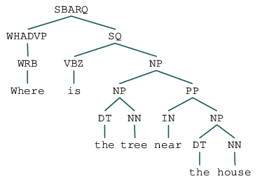
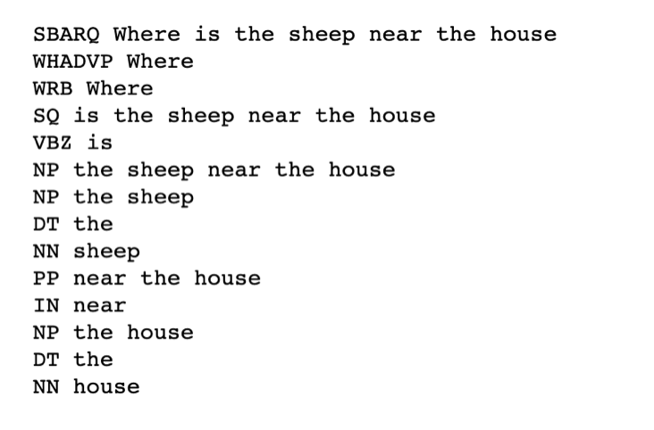
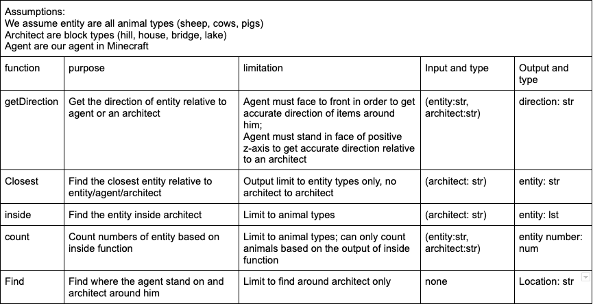
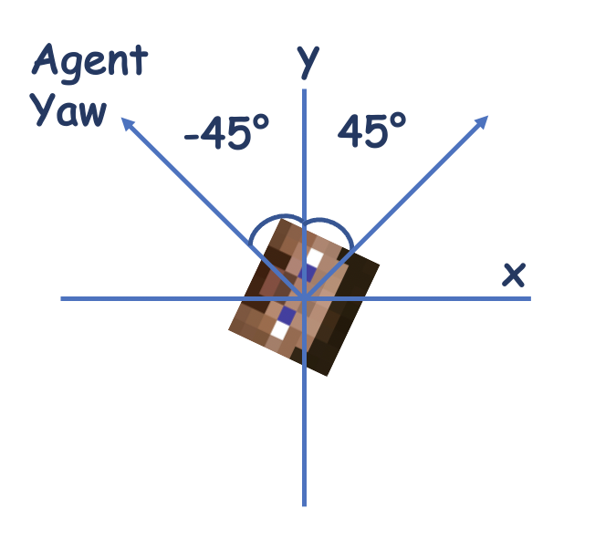
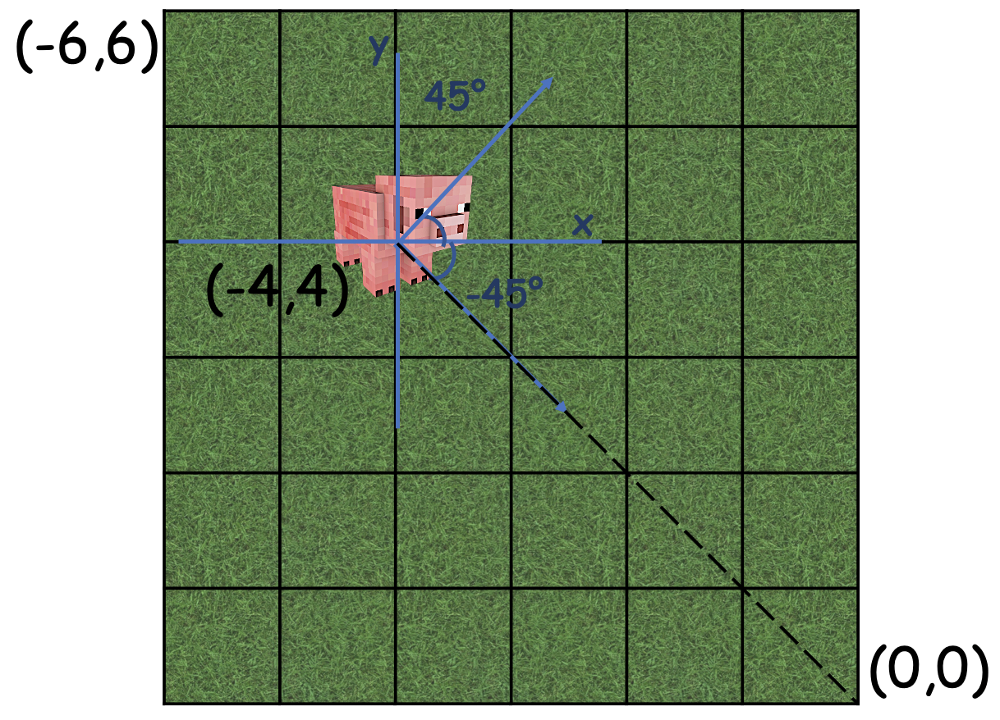
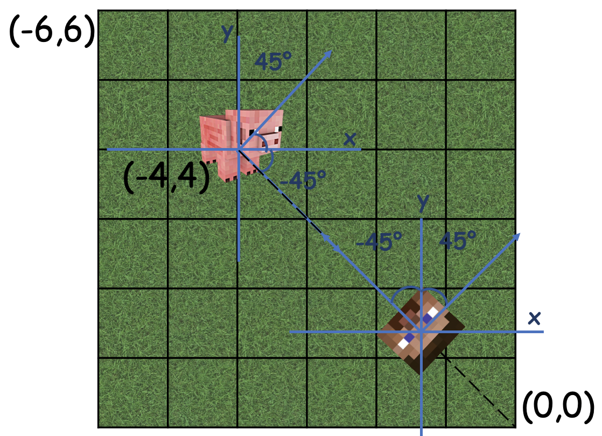
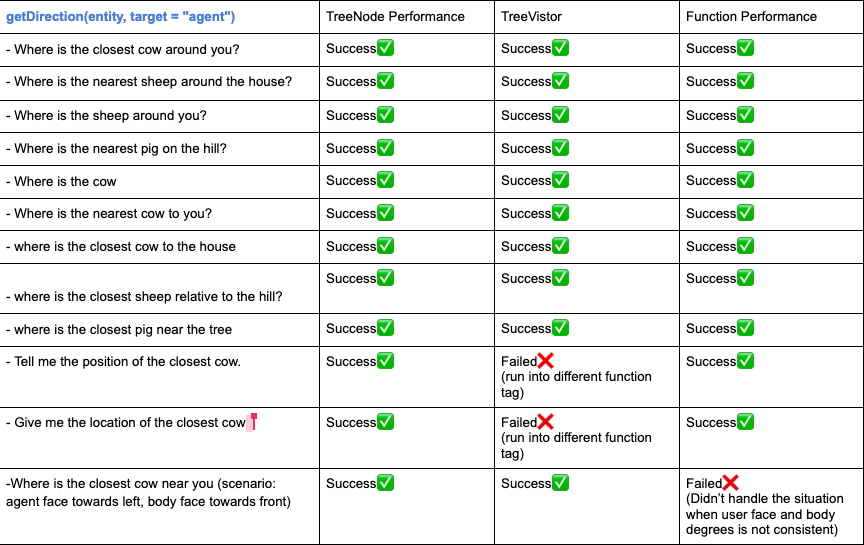
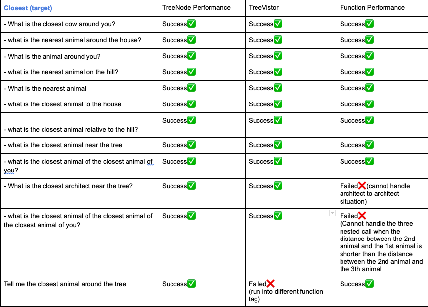

## Video

<iframe width="600" height="336" src="https://www.youtube.com/embed/PkxCH6EV8Pk" frameborder="0" allowfullscreen></iframe>

## Project Summary

The main goal of this project is to build an "environment-describing chatbot" which can understand users' questions about surrounding environment and answer expected information retrieved through Malmo API. To achieve this goal, we focused on two parts: the first part is natural language processing (NLP), and the second part is implement environment decribing functions to retrieve related information.

The main challenge is that, instead of matching our functions with specific language description/user questions, we want our NLP processing and functions to deal with languages with greater scope and flexibility when asking questions. In other words, our chatbot needs to have a clear understanding on the individual parts of the speech and the dependencies in between; in order to connect user questions with correct environmental describing function and pass corresponding arguments. For instance, consider two questions:

- "How many sheep are inside the house"
- "What animals are inside the house"

The meanings of these sentences are quite different, and our chatbot need to understand the first question is asking about "count(cows, inside(house))", and the second question is asking about "find(animals, inside(house))". In order to achieve this, using a deep learning model for NLP is necessary to help us to process the syntatic structure of user's question. We utilized AllenNLP constituency parsing tools into our project in order to get a syntatic tree model.

Besides understanding users' question, we also need environment describing functions to ensure we return accurate information to our users. In this part, we deployed Malmo API to get basic environment information in the enviornment we build in Minecraft, and create purpose functions by using these information. Our projects can handle questions like,

1. Find closest entity relative to agent architecture or other landscapes
2. Identify entity location relative to agent architecture or other landscapes
3. Count entities based on position
4. Describe current environment (such as find animals around the tree, and tell the location of the agent)

The challenge behind this part is that we need to be familiar and knowledgable enough to Malmo and efficiently convert the provided information to our environment describing function.

## Approaches

<em>Figure 1: Project Idea </em>

### Natural Language Processing through Constituency Parsing

In this project, we utilize the **AllenNLP constituency parsing** to to understand the syntatic structure of user's question, and build a new tree to store the constituency tree based on our needs and visit the new tree matching it with our function. Below is the picture showing the constituency tree AllenNLP generated for us: 
<em>Figure 2: Sample Constituency Tree </em>

The sample question of the above tree is "Where is the sheep near the house", and the linearized version of the above contituency tree looks like '(SBARQ (WHADVP (WRB Where)) (SQ (VBZ is) (NP (NP (DT the) (NN sheep)) (PP (IN near) (NP (DT the) (NN house))))))'. After getting the tree string that AllenNLP returned, we constructed a new tree to store it by pairing label and its covering texts. For instance, in the above tree, we can access to all the labels and its covering texts. Figure 2 shows an example of TreeNode output of the above constituency tree string as input.

<em>Figure 3: TreeNode Output </em>

Then, we implement a tree vistor in order to go over all the tree node and extract "valuable" information we need to match with our functions and pass correct arguments. To accomplish that, we firstly pass the tree root to the visitor and use a stack structure to store the node's children. By recursively call visit on the children, we will go over all the node types, which we will ignore some useless labels/texts, and only extract information from valuable node. For instance, suppose we have a question like "Where is the cow near the house". We will firstly pass the tree node to our visitor, which is a node with label (SBARQ) and text "Where is the tree near the house". Then, by visiting its children node text, we will know it is a where question, so we can match the question with our "getDirection(entity, target)" question. Then, we will recursively visit the node's children by pop(0) from our node stack structure and find "NN" label(noun) and pass it to our function. Since the getDirection function takes two Noun words as parameter, the first Noun (NN) we popped out from node stack will be passed as "entity" and the second Noun(NN) we met will be passed as "target". 

### Environmental Describing Function

To get the observation results from our agent, we generate our answers using the Malmo build-in function: **agent.peekWorldState()**. From the converted json text, we could get information of the surrounding envrionment based on our agent's current position, like entity names, entity coordinates and the degree where they are facing. All of our four types of questions are implemented in the **CommandAction** Class. The image below shows the summary of all our functions, and what kind of scenario our chatbot can handle. 

<em> Figure 4: Function List</em>

#### Find closest entity relative to agent architecture or other landscapes

Function name: closest(block: str)
This function take architectures in the string format as our input and then returns one or more entity names in the string format. Possible inputs includes "agent", "house", "tree", "lake" and "hill".

To get the closest entity near the agent or other lansacapes in the world, we will first get the current coordinate of the agent or the coordinates for our lansacpes. So far, our lansacpes (house, lake and hill) are defined by four coordinates, except for trees, which are defined by one coordinate. By computing the distance of the surrounding entities to our target, we will sort this result by their distance and then outputed the closest entity name. For house, lake and hill, we also excludes the entities inside these space.

#### Identify entity location relative to agent architecture or other landscapes

Function name: getDirection(entity_type: str, target: str)
This function take entity_type and architectures as target in the string format, it then returns the direction of the selected entity to the target in the string format.

To get the entity location, such as left, right or front of some object, we also need to know how their current coordinate compared to the coordinate of your target. If the user did not specify the entity type ('Pig', 'Cow' or 'Sheep'), our function will output the direction of the closest entity to the target in the default mode.
For computing entity location relative to the agent, we also need to consider the degree of where our agent is facing as one variable to our algorithm. The following two graphs shows the difference between the "yaw" outputed by Malmo and the entity degree calculated by the arctan function [$\arctan$ $( (y1-y2)/(x1-x2) ) * 180$ $/$ $\pi$]. Since the coordinate system of Mlamo is different to the normal mathematical coordinate system, we also converts x coordinates to negative when calculate degrees.

<em> Figure 5: Agent Yaw</em>

<em> Figure 6: Entity Degree Calculation</em>

Then we will compare their difference based on four difference cases.

1. agent_y > entity_y, agent_x > entity_x
2. agent_y > entity_y, agent_x < entity_x
3. agent_y < entity_y, agent_x > entity_x
4. agent_y < entity_y, agent_x < entity_x

For example, we first add up agent yaw(figure 5) and entity degree(figure 6) which is equal to -90 degree. If we are now in the case 4, we could discover that when their degree summation is around -90 degree, the entity is at the front of the agent. (Figure 7 could be used for reference). Undoubtedly, all the "in front of" situations are different in the above four cases, as well as "right", "left" or "behind". Therefore, this is the process of how we figure out this pattern.

<em>Figure 7: Result calculation</em>

#### Count entities inside based on position

Function name: inside(block: str)
This function take architectures in the string format and then returns the a list of entity types which are inside that architecture.

Function name: count(entity_type: str, block: str)
This function take entity_type and architectures as input in the string format, it then returns the count of total entities in that architecture or the count of a specific entity.

For this type of question, we support asking what animals are inside in a certain location(house, lake, hill) and what's the number of the total animal or what's the number of a specific animal. Based on comparing entity coordinates and our location space defined by four coordinates, we will output a list of entities if their coordinates are inside the range of the current space. Then, from this list, we could get the total count and the count of any specific entity types.

#### Describe current environment / tell the location of the agent

Function name: describe_agent_location()
This function takes no parameters; it only based on the current coordinate and the current yaw of the agent to output the current view of what we can see in this whole game world.

Based on the current coordinate and yaw of our agent, we will output where is the agent standing based on its current observation and what landscapes in the game world our agent can see right now. For example, if our agent is standing on the hill in our map, our system will output "I am standing on the hiil in a village, and I can see there is a house and a lake below me."

## Evaluation

During the evaluation process, we focus on a)evaluating the returning value of our **TreeNode**, b)Accuracy of our **environment describing functions**, and c)**TreeVisitor** functionality. Therefore, we divided our evaluation process into three phrases accordingly.

To start with, we listed 10 sample questions based on each environmental describing function, and used them as sample input to test the success for each phrase. Here is a sample testing table of our "getDirection" and "closest" functions.

<em>Figure 8: getDirection Test Table</em>

<em>Figure 9: Closest Test Table</em>

a) In order to evaluate the TreeNode class, we built a **iter** function in the class, in order to visually evaluate if it succesfully match syntatic label with its covering text. Since the success of our class TreeNode is discrete, by printing out each node's label and text, we are able to manually compare it with the constructed constituency tree and tell if it is successful or not.

b) For the qualitative environment describing function testing, we manually compare the terminal output with what we truly perceive in the game world. Figure 10 shows six passed examples of that. 

<em>Figure 10: Real execution scenario</em>

c) We tested the TreeVisitor class after testing TreeNode and function. Since the TreeVisitor class used the return value of TreeNode as input and connect user command with our environmental describing functions, we need to make sure the accuracy of the first two phrases before going to this step. In this phrase, we focus on evaluating if 1/it successfully extract information to connect the input (user question) with our function, and if the argument is positioned into the right place. We tested TreeVisitor class by connecting with our environment describing functions in order to visually see the pass/failture of our class in Malmo.

Overall, as shown in the video, we also garantee that the total response time is no more than 1 second through the above three steps which also fullfilled the basic requirment of this chatbot system.

## References

#### [XML Schema Documentation](http://microsoft.github.io/malmo/0.14.0/Schemas/MissionHandlers.html)

#### [AllenNLP: Constituency Parsing](https://demo.allennlp.org/constituency-parsing)

#### [Project Malmo](https://github.com/microsoft/malmo)

#### Professor Sameer Singh Pseudocode
