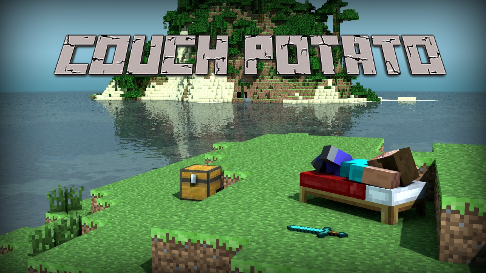

### [Download Our Source Code Here](https://github.com/SkellyDev/CouchPotato)

## Welcome to Couch Potato!

Imagine you are a super lazy person who do not want to think about anything while playing the game, our **Couch Potato** could provide you with the opportunity to seek for any simple answers from the senario via command lines. Assume that you could only learn about the game world by asking our agent, when you type into your questions, our agent will answer your question based on what he could conceive and for sure, our tool will accept different expressions of the same meaning for user inputs.

To achieve this goal, we build our project based on Natural Language Processing (NLP) concepts. For each user-input command, we will extract keywords based on the syntax of the phrase and then match them to our existing action functions. For example, commands like "Describe the position of the closest pig", "Tell me where is the pig standing" and "Where is the closest pig" will output the same answer.

## To explore more about COUCH POTATO, feel free to check Our progress:

#### [Click here to see our proposal page](proposal.html)

#### [Click here to see our status report](status.html)

#### [Click here to see our final report](final.html)

## The tools we use

<a href="https://github.com/microsoft/malmo">Project Malmo</a> 
More libraries to be added...
