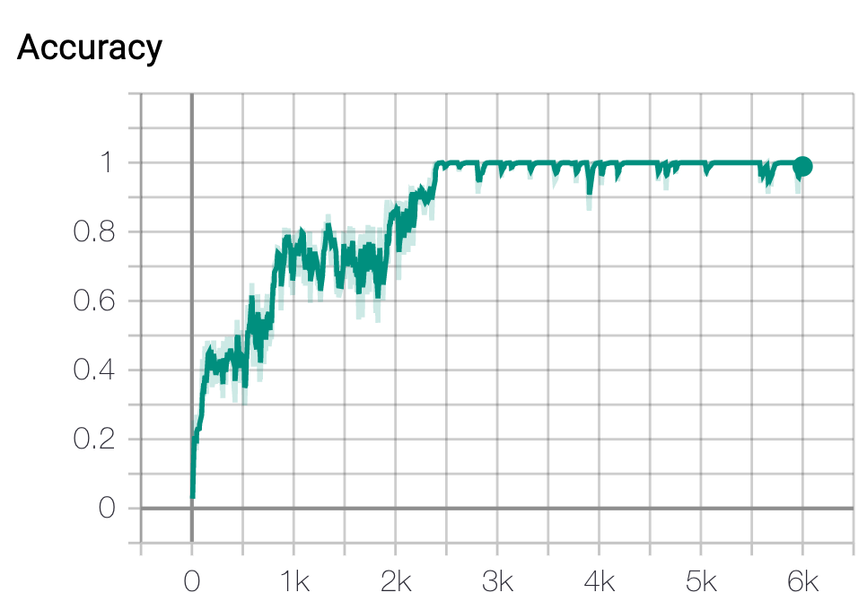

# Couch Potato

Insert video

## Project Summary

We intent to build a environment description system for this project which enable users to ask questions to our Malmo agent and then get the answer back through the terminal. All scenario information will be obtained from the Malmo APL, and envrionment describing functions are implemented to compute the target results based on the raw world state information. Questions will include but not limit to “how many pigs can you see in your view”, “what is the river” and “How many black sheep can you see?”. Our project is expected to train a Neural Network Model in order to match user command with correct envrionment describing function. Natural Language Processing (NLP) will be used to parse users' command passing as correct argument. We will handle the situation of different expressions for the same way asking by using a Neural Network Model.

## Approach

Our projects mainly includes two stages: (1) Generating observation results and (2) Understand User Command
 (1) All of the results to the user input questions are generated by our system background using Malmo build-in function: **agent.peekWorldState()**. After we convert the result into readable json text, we can get all the current positions and quantities of different entities based on our map coordinate system. In **CommandAction** Class, we wrote both helper functions and envrionment describing functions in order to get scenario information based on the Malmo state. Three main envrionment describing functions are implemented: "find closest entity", "find location of closest entity relative to agent", and "find location of closest entity relative to a block". When implementing envrionment describing functions, we assume all block types (e.g. lake, trees, houses) are static, while entity types (cows, sheep, pigs) are active.

  By using the distance formula, we could get the distance between two entities. Therefore, from a given location (e.g. agent's current location) and a given default range, we are able to find the nearest entity relative to both agent/other static blocks. Calculating position (left, right, behind, front, etc.) for one entity relative to a static architect is simple by just comparing their x and y coordinates. However, when find positions of entity relative to the agent, we need to take where the agent faces into consideration. The attribute of this facing direction is represented as "Yaw" in degress for our agent in the world state (Figure 1); since this degree is relative to the (0,0) point of our map, we've also calculate the dergree of where the target entity standing relative to the zero point. By comparing the difference between these two degrees, we could get our result position. Also, based on the difference (negative/positive) between the distance from (0,0) to the entity and to the agent, the calculation is be reverted.

<em>Figure 1: Position calculation</em>

 (2) In order to match user command with correct envrionment describing function that we wrote in CommandAction class, we built a **Neural Network model** to train all the commands. We firstly sort all user commands into five different tags, which are 1/greeting 2/goodbye 3/find closest animal 4/find location of closest animal relative to agent 5/find location of closest animal relative to block. Each question tag matches with one specific envrionment describing function. Then, we write sample command questions for each question tag and stored both tags and sample commands as dictionaries into a **json file**. For each question tag, we first use **one-hot encode data** to transfer all words in sample questions into numbers, which will be passed as training data to our NN model. Each encoding data list will record the existence of a word under one specific question tag. Expected output tag label are also created to match with those one-hot encode data. Then, we use **tensorflow** to create a one input layer, two fully connected hidden layers(with 5 hidden neurons), and one output layer Neuron Network layer with **softmax activation function**. Therefore, our output will be possibilities connected to each neuron (question tag in this case). By passing same training data 1000 times and output label into our NN model, we will get a trained NN model saved into data pickle. Then, we use one-hot encode to transfer user command question into number array, and pass it into our trained model to get the question tag with **highest possibility**. By reading the output, we are able to understand user command by calling corresponding envrionment describing function. At last, we use tool **pos_tag** in nltk to parse user command in order to find correct argument passing to each envrionment describing function.

## Evaluation

Evaluation will be divided into two parts based on our project stages (1) check if the information returned from environment describing functions are correct (2) check the accuracy of our NN model
  In order to check the information accuracy returned from our environement describing function, we mainly use the black box testing technique and manually test our function by giving multiple inputs and comparing output with expected output.
  To check DNN model accuracy, we see the accuracy rate returned from our trained DNN model. (Figure 2)

<em>Figure 2: DNN model accuracy</em>

## Remaining Goals and Challenges

(1) Improve the flexibility of entity types
 Fow now, our model only support animal types "Pig", "Cow" and "Sheep" for all entity types; later on, we will add flower types and mushroom types, so that we will implement new questions like "What's the color of the flower in front of you" and "How many red flowers are planted aroung the lake".
  (2) Create new envrionment describing functions (Current only includes “what” and “where” questions)
 Currently, we only have questions and answers to the "what entity" and "relative position" questions; we plan to enrich those answers with more features constructed in our map, like "standing on the grass", "standing on the hill" and "standing under the tree". Also, we are going to include more questions or elements on describing textures of the architects. (e.g. "What's the house made of?" will get response "It's made of golden ores".)
  (3) Allow users to combine several commands in one input, seperated in sentences.
  This is also one of our challenges which intend to add up or merge several answers together, so that users can ask several different things in one question seperated by "and", commas or semicolons. (e.g. What is the closest animal relative to house and what is that house made of?)
  (4) Enable real action functions (e.g. Ask the agent to go to a certain location [front of the house, swim in the lake…], implementing shortest path function)
 Our goal is that wherever the agent is standing in the map, when user commands our agent to go to somewhere, the agent will always find the shortest and fastest (Avoid walking in the lake) path to the target location. Based on the data structure's size and run time, we may change the algorithm for the shortest path fucntion.
  (5) Enable input-based command options, so that users don’t need to pause the game
  Right now, everytime when we want to input the command, we will need to press "ESC" to leave the game and then resume the game to change our agent's current location. If we could implement commands for totally manipulating the agent, users will not need to pause the game.

## Resources Used

[ We build our NN model based on a Youtube tutorial on chatbot.](https://www.youtube.com/watch?v=wypVcNIH6D4&list=PLzMcBGfZo4-ndH9FoC4YWHGXG5RZekt-Q&index=1)
